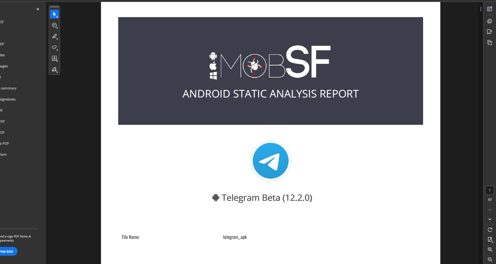
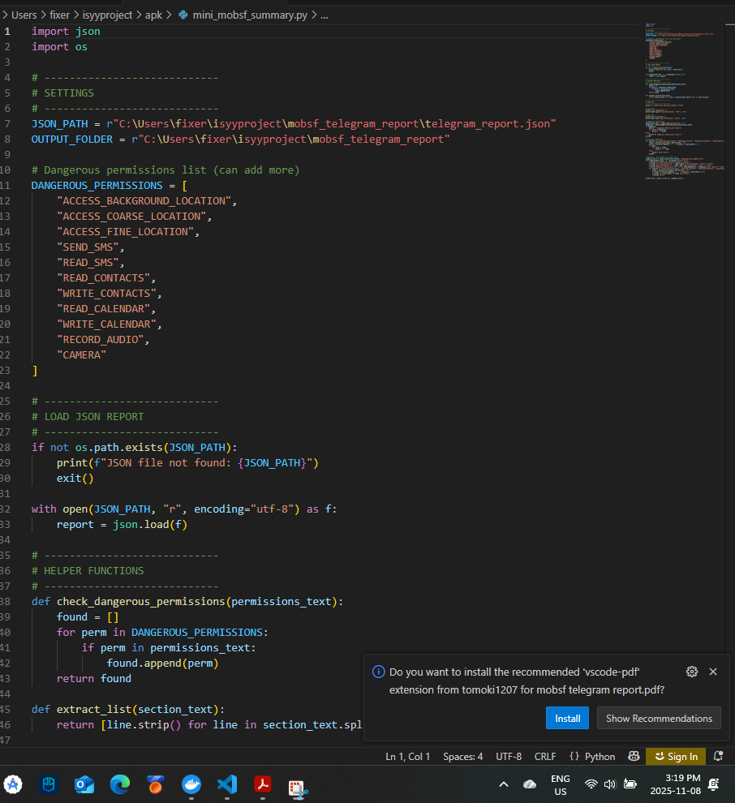

<<<<<<< HEAD:Misc/Israel Ogunseye/README.md
# Telegram APK MobSF Analysis

## 1. Objective
Analyze Telegram Beta APK using MobSF to detect:
- Security issues
- Dangerous permissions
- Exposed components
- Trackers
- Signing certificate

## 2. Setup
- MobSF running locally at `http://127.0.0.1:8000`
- APK analyzed: `telegram.apk`
- Python scripts used:
  - `pdf_to_json.py` → Extract PDF report to JSON
  - `mini_mobsf_summary.py` → Highlight dangerous permissions and exported components

## 3. Steps Taken
1. Uploaded Telegram APK to MobSF dashboard  
   
2. Examined scan results: scorecard, permissions, services, trackers  
   
3. Downloaded PDF report and converted it to JSON  
   
4. Used Python scripts to summarize findings in JSON and mini summary  
   

## 4. Findings
### 4.1 Permissions
- Dangerous permissions detected: `ACCESS_BACKGROUND_LOCATION`, `SEND_SMS`, etc.  
  

### 4.2 Exported Components
- Activities, services, receivers, providers visible from analysis  
  

### 4.3 Signing Certificate
- Certificate info: issuer, algorithm, valid dates  
  

### 4.4 Trackers & User Data
- Trackers found, potential sensitive information  
  
  

## 5. Difficulties Encountered
- JSON download via API returned 404 initially  
- Python upload script failed until correct APK path and API key were set  
- PDF extraction required line-by-line parsing due to MobSF formatting

## 6. Conclusion
- Telegram APK contains several dangerous permissions and exported components  
- MobSF dashboard, PDF, and JSON report provide full insight into security posture

## 7. Files Included
- `PDF_Report/telegram_report.pdf`  
- `JSON_Report/telegram_report.json`  
- Screenshots in `Images/`  
- Python scripts in `Scripts/`
=======
# Telegram APK MobSF Analysis

## 1. Objective
Analyze Telegram Beta APK using MobSF to detect:
- Security issues
- Dangerous permissions
- Exposed components
- Trackers
- Signing certificate

## 2. Setup
- MobSF running locally at `http://127.0.0.1:8000`
- APK analyzed: `telegram.apk`
- Python scripts used:
  - `pdf_to_json.py` → Extract PDF report to JSON
  - `mini_mobsf_summary.py` → Highlight dangerous permissions and exported components

## 3. Steps Taken
1. Uploaded Telegram APK to MobSF dashboard  
   
2. Examined scan results: scorecard, permissions, services, trackers  
   
3. Downloaded PDF report and converted it to JSON  
   
4. Used Python scripts to summarize findings in JSON and mini summary  
   

## 4. Findings
### 4.1 Permissions
- Dangerous permissions detected: `ACCESS_BACKGROUND_LOCATION`, `SEND_SMS`, etc.  
  

### 4.2 Exported Components
- Activities, services, receivers, providers visible from analysis  
  

### 4.3 Signing Certificate
- Certificate info: issuer, algorithm, valid dates  
  

### 4.4 Trackers & User Data
- Trackers found, potential sensitive information  
  
  

## 5. Difficulties Encountered
- JSON download via API returned 404 initially  
- Python upload script failed until correct APK path and API key were set  
- PDF extraction required line-by-line parsing due to MobSF formatting

## 6. Conclusion
- Telegram APK contains several dangerous permissions and exported components  
- MobSF dashboard, PDF, and JSON report provide full insight into security posture

## 7. Files Included
- `PDF_Report/telegram_report.pdf`  
- `JSON_Report/telegram_report.json`  
- Screenshots in `Images/`  
- Python scripts in `Scripts/`
>>>>>>> 5348b93 (Move all MobSF Telegram analysis files into Israel Ogunseye folder):Israel Ogunseye/README.md
