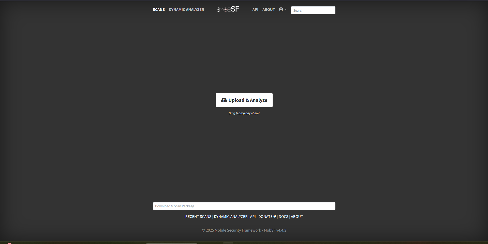

# Weekly Progress Report – MobSF Setup

**Date:** 03-Nov-2025  

---

## Progress Summary
This week, I focused on setting up the **Mobile Security Framework (MobSF)** tool for our mobile application security analysis project.

**Steps Completed:**
1. Downloaded and extracted `Mobile-Security-Framework-MobSF-master.zip`.
2. Installed **Docker Desktop** on Windows and configured WSL2 for container support.
3. Built the MobSF Docker image and ran the container successfully.
4. Confirmed that MobSF is accessible via browser at `http://127.0.0.1:8000` and verified default login credentials (`mobsf/mobsf`).

---

## Challenges
- Initial difficulties with Docker container names and commands (`mobs` vs `mobsf`).  
- Ensuring the container stayed running to allow login and further analysis.  
- Navigating Docker and MobSF setup as a first-time user was slightly complex.

---

## Next Steps
- Start **analyzing APK files** using MobSF.  
- Generate static and dynamic analysis reports.  
- Explore REST API integration for automated scanning.

---

## Outcome
MobSF is now **up and running** on my system, ready for mobile application security testing.

---

## Screenshots
1. **MobSF Dashboard :** 

    

2. 

3.  

**End of Report**
